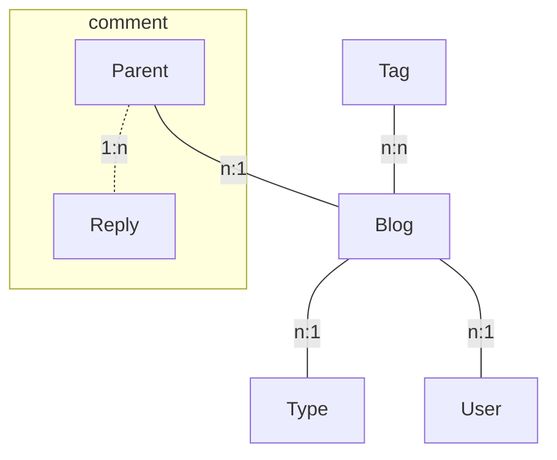
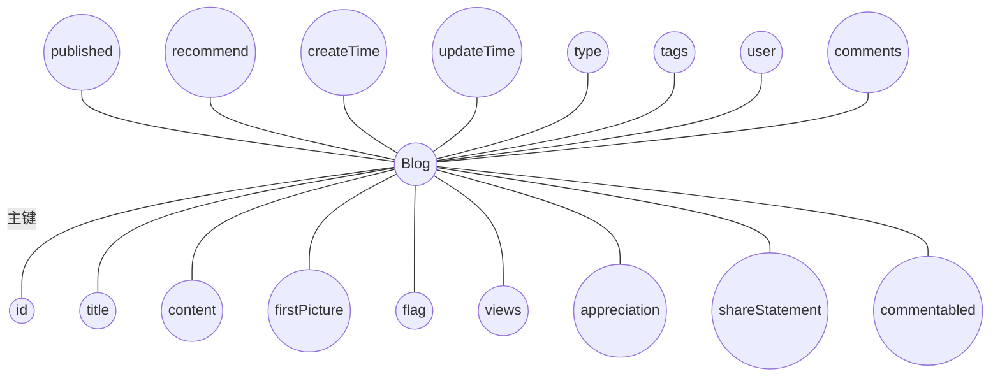

## Blog 系统总结（2）数据库设计

### 1. 总体设计

由分析易知，一个要实现前后台博客 CRUD，评论功能的系统，数据库应该如下设计。

首先画出 E-R 图



### 2. 实体类设计

针对每一个实体设计每一个实体具有的属性

* Blog



然后在业务包下新建 po 包，在包下新建 `Blog` 实体类，代码如下

```java
@Entity
@Table(name = "t_blog")
public class Blog {
    @Id
    @GeneratedValue
    private Long id;
    private String title;
    private String content;
    private String firstPicture;
    private String flag;
    private Integer views;
    private boolean appreciation;
    private boolean shareStatement;
    private boolean commentabled;
    private boolean published;
    private boolean recommend;
    @Temporal(TemporalType.TIMESTAMP)
    private Date createTime;
    @Temporal(TemporalType.TIMESTAMP)
    private Date updateTime;

    @ManyToOne
    private Type type;

    // 级联新增
    @ManyToMany(cascade = {CascadeType.PERSIST})
    private List<Tag> tags = new ArrayList<>();

    @ManyToOne
    private User user;

    @OneToMany(mappedBy = "blog")
    private List<Comment> comments = new ArrayList<>();

    @Transient
    private String tagIds;
  
  	// getter and setter...
}
```

首先，在类前加 `@Entity` 注解将该类注册为实体，从而可以映射到数据库。然后 `@Title(name = 'xxx')` 注解定义映射到的数据库所建表名。

在类中，通过 `@Id` 将 id 属性设置为该表的主键，`@GeneratedValue` 注解则将 id 属性定义为由数据持久框架自动赋值，它会自动给数据库每条记录赋一个唯一的值。

当属性是 Date 属性值时，要将其用 `@Temporal(Temporal.TIMESTAMP)` 定义其为时间值。

当这里的属性其实是数据库中另一个实体的时候，可以用 `@ManyToOne`、`@OneToMany`、`@ManyToMany` 注解表示它们之间的关系。然后要用 `mapped by = "xxx"` 指名它们的维护方，一般来说，一对多的关系由这个一作为维护方。上面的代码中，Blog 和 Type 就是多对一的关系，所以在这里 type 被指明 `@ManyToOne`，然后在 Type 类中，有 `List<Blog> blogs` 变量被指明`@OneToMany(mapped by = "type")`。

对于多对多的关系，要通过 `@ManyToMany(cascade = {CascadeType.PERSIST})` 将该属性设置为级联新增，当保存该 Blog 实体时，若数据库内没有对应的 Tag 实体，那么就可以在数据库中新增这个 Tag 实体。

实体类要求必须是一个 Java Bean，所以要对这些属性定义 get 和 set 方法，在 IDEA 中，只要按下 `⌘ + N` 快捷键，就可以找到 getter and setter 选项自动定义 getter and setter 方法了。

其他的实体类的设计方法和这个大同小异，就省略了画 E-R 图的过程。

* Type

```java
@Entity
@Table(name = "t_type")
public class Type {
    @Id
    @GeneratedValue
    private Long id;
    // @NotBlank 后台非空校验（老版本）
    private String name;

    @OneToMany(mappedBy = "type")
    private List<Blog> blogs = new ArrayList<>();
  
  	// getter and setter
}
```

* Tag

```java
@Entity
@Table(name = "t_tag")
public class Tag {
    @Id
    @GeneratedValue
    private Long id;
    private String name;

    @ManyToMany(mappedBy = "tags")
    private List<Blog> blogs = new ArrayList<>();
  
  	// getter and setter
}
```

* Comment

```java
@Entity
@Table(name = "t_comment")
public class Comment {
    @Id
    @GeneratedValue
    private Long id;
    private String nickname;
    private String email;
    private String content;
    private String avatar;
    @Temporal(TemporalType.TIMESTAMP)
    private Date createTime;

    @ManyToOne
    private Blog blog;

    @OneToMany(mappedBy = "parentComment")
    private List<Comment> replyComments = new ArrayList<>();

    @ManyToOne
    private Comment parentComment;
  
  	// getter and setter
}
```

* User

```java
@Entity
@Table(name = "t_user")
public class User {
    @Id
    @GeneratedValue
    private Long id;
    private String nickname;
    private String username;
    private String password;
    private String email;
    private String avatar;
    private Integer type;
    @Temporal(TemporalType.TIMESTAMP)
    private Date createTime;
    @Temporal(TemporalType.TIMESTAMP)
    private Date updateTime;

    @OneToMany(mappedBy = "user")
    private List<Blog> blogs = new ArrayList<>();

  	// getter and setter
}
```

### 3. 注意的点

注意到 Comment 类由于考虑到评论和针对某条评论的回复两种情况，很显然评论和回复是树的关系。即一对多的关系。对于父级评论 parentComment，此时类作为回复来看，可以有多条回复，所以注解是 `@ManyToOne`。同理，同样维护方交给一那一方，即 parentComment。

要提前配置好 Spring Boot 环境，即写好 `application.yml` 文件。然后启动项目。查看数据库就会发现数据持久框架已经自动建好了数据库。