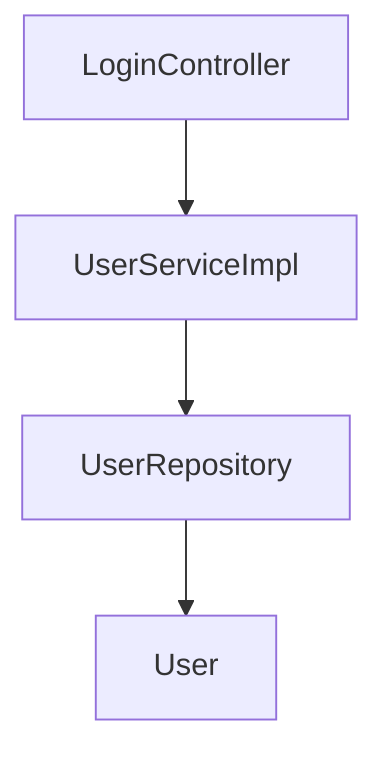

## Blog 系统总结（3）登录逻辑设计

### 1. 设计概述

设计登录模块是为了保护后台管理的安全，并且验证操作是否是 admin。

在服务器或测试主机上，已经添加了 admin 的 User 信息。

### 2. 框架结构



`LoginController` 负责控制页面间的跳转，对于博客系统，大部分具体的业务逻辑都在这里。

`UserServiceImpl` 负责实现 `UserService` 定义的方法，这里是定义关于 `User` 可以实现的功能。

`UserRepository` 负责定义 JPA 具体操作数据库的一些方法。

`User` 是 PO，负责定义 'User' 这个实体。

### 3. 逻辑设计

先从上向下分析登录的逻辑，登录的本质，就是当用户填写好用户名和密码后，提交表单给服务器，服务器将用户名和密码与数据库已有 User 数据进行比对，若比对成功，则将 User 属性加入到本次 HTTP Session 中，保存登录成功信息并且方便登录成功后在页面上显示用户信息。若比对不成功，则重定向到登陆页面。

与此相对的，当处在管理后台时，前端设计了注销按钮，当点击时，会发送 get 请求，从 HTTP Session 中删除 User 属性，并重定向到登录页面。

默认初始登录时返回到登录页面。

从以上分析再自下而上分析，则需要在 DAO 层中实现由用户名和密码查询 User 表中元素的方法。需要在 Service 中定义由用户名和密码检查用户的方法，并且返回一个 User 对象。

### 4. 登录功能代码

* LoginController

```java
@Controller
@RequestMapping("/admin")
public class LoginController {
    @Autowired
    private UserService userService;

    @GetMapping
    public String loginPage() {
        return "admin/login";
    }

    @PostMapping("/login")
    public String login(@RequestParam String username,
                        @RequestParam String password,
                        HttpSession session,
                        RedirectAttributes attributes,
                        Model model) {
        User user = userService.checkUser(username, password);
        if (user != null) {
            user.setPassword(null);																			// 在session保存时清空密码保证安全
            session.setAttribute("user", user);
            model.addAttribute("activeuser", user);
            return "admin/index";
        } else {
            attributes.addFlashAttribute("message", "用户名或密码错误");
            return "redirect:/admin";
        }
    }

    @GetMapping("/logout")
    public String loginout(HttpSession session) {
        session.removeAttribute("user");
        return "redirect:/admin";
    }
}
```

这里，控制器要用 `@Controller` 注解定义。`@RequestingMapping("/admin")`	和 `@GetMapping`	,`@PostMapping` 一样是定义网页 URL 的注解。例如在本机测试时，当在浏览器输入 127.0.0.1:8080/admin，会自动被 LoginController 捕获，并进入到默认的 "/" 的 get 请求页面，即 loginPage() 方法返回的页面。

HttpSession 可以在浏览器运行的一段会话内保存一些属性信息。model 可以保存一些属性供页面调用。

* UserServiceImpl

```java
@Service
public class UserServiceImpl  implements UserService{
    @Autowired
    private UserRepository userRepository;

    @Override
    public User checkUser(String username, String password) {
        User user = userRepository.findByUsernameAndAndPassword(username, password);
        return user;
    }
}
```

服务要用 `@Service` 注解定义。`@Autowired` 注解用来自动注入装配对象，比如说在 Controller 里用 Service 对象，Service 里用 DAO 对象都需要将其自动注入。

* UserRepository

```java
// 数据持久层
public interface UserRepository extends JpaRepository<User, Long> {
    User findByUsernameAndAndPassword(String username, String password);
}
```

数据持久层框架可以自动定义一些 find, get, update, save, delete等开头的方法，实现数据库的对应功能。

### 5. 关于登录安全的设计

#### 登录拦截

如果对方知道了你的网页文件结构，如直接访问 127.0.0.1:8080/admin/blogs，如果没有登录拦截功能，就可以直接进入后台管理页面了。所以需要登录拦截。

所以设计一个登录拦截类，它继承自 HandlerInterceptor，需要重写 `preHandle` 方法，进行拦截器的预处理。代码如下。

```java
public class LoginInterceptor implements HandlerInterceptor {
    @Override
    public boolean preHandle(HttpServletRequest request,
                             HttpServletResponse response,
                             Object handler) throws Exception {
        if (request.getSession().getAttribute("user") == null) {
            response.sendRedirect("/admin");
            return false;
        }
        return true;
    }
}
```

如果返回 false，则流程中断，即被拦截。如果返回 true，则流程继续，未被拦截。

还需要设计一个 WebConfig 类来定义拦截规则应用于项目，该类继承自 WebMvcConfigurer。通过重写 `addInterceptors` 方法定义拦截规则。代码如下。

```java
@Configuration
public class WebConfig implements WebMvcConfigurer {
    @Override
    public void addInterceptors(InterceptorRegistry registry) {
        registry.addInterceptor(new LoginInterceptor())
                .addPathPatterns("/admin/**")
                .excludePathPatterns("/admin")
                .excludePathPatterns("/admin/login");
    }
}
```

在 Spring Boot 项目中，若要为项目定义配置类，要用 `@Configuration` 注解进行定义。

`addPathPatterns` 添加拦截条目，**代表任意字符。

`excludePathPatterns` 删除拦截条目，即默认放过。
