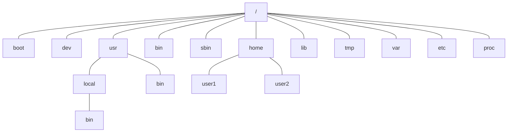
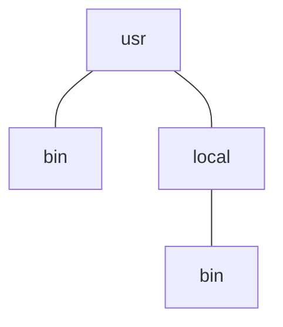

## Linux 目录结构

>  Linux 和 macOS 等系统和 Windows 最大的区别就是它们没有“盘符的概念”，即可以将整块硬盘视为一个整体，而且还有“一切皆文件”的思想，即一切内容，甚至是硬件都可以视作一个文件。这篇文章总结一下 Linux 系统的目录结构，把各个目录的作用都整理一下以备以后查看。

### 1. 整体结构 

与 UNIX 系统类似，Linux 系统的目录结构是一棵标准的树。一个简略的架构如下：



其中，`/` 是文件系统的根目录，是整个文件系统的根。著名的犯罪命令

```bash
sudo rm -rf /*
```

就是从文件系统的根节点开始递归的全部删除文件，这样会使整台机器的所有内容都被删除，从而无法工作。

### 2. 详细介绍

#### bin

Binaries（二进制文件），这里存放的是整个系统必须的二进制文件或可执行文件


#### sbin

System binaries（系统二进制文件），这里存放的是只能由 root 用户执行的系统二进制文件


#### lib

Libraries（库文件），这里存放许多二进制都会用到的公共库文件


#### usr

User binaries（用户二进制文件），用来存放非操作系统必须的二进制文件或应用程序，面向最终用户。



其中 bin 目录存放着面向最终用户的二进制文件。

其中 local 目录存放着用户手动编译的二进制文件，这个目录的目的是为了创建一个安全区，防止它们与包管理器安装的软件发生冲突。

#### $PATH

$PATH 是 Linux 环境的一个变量，包含由包管理器安装的二进制文件的位置。

在 $PATH 声明环境变量，这样就可以在任何目录执行这些二进制文件。

想要知道命令在文件系统的完整路径，可以用 which 命令去查找。

```bash
which ls
/bin/ls
```

#### etc

ET Cetera or Editable Text Config（其他或可编辑文字配置），用来配置系统中软件的具体行为。


其中，一些以 `.conf` 结尾的文件就是文本形式的配置文件。

#### home

Linux 支持多用户，每个注册的用户都会在 home 里有一个对应的目录，目录下存有用户的文件、配置和软件。

#### boot

靴子，这里指的系统启动所需要的文件，比如 Linux kernel 就在 boot 目录下。

#### dev

Devices（设备），这里存放注册的各个设备。Linux 的设计理念就是“一切皆文件”，所以这里的设备在 Linux 看来也是一个文件。通过编辑文件，可以管理硬件设备和驱动。

#### opt

Options（选项），这里存放可选的软件和软件包，基本不会对系统的正常工作产生影响。

#### var

Variables（变量）,这里存放操作系统中会发生变化的文件。比如系统日志和缓存文件。

#### tmp

Temps（暂时文件），这里存放临时文件，重启后就会被清除。

#### proc

Process（进程），由系统创建在内存上用来监控运行中的进程。


