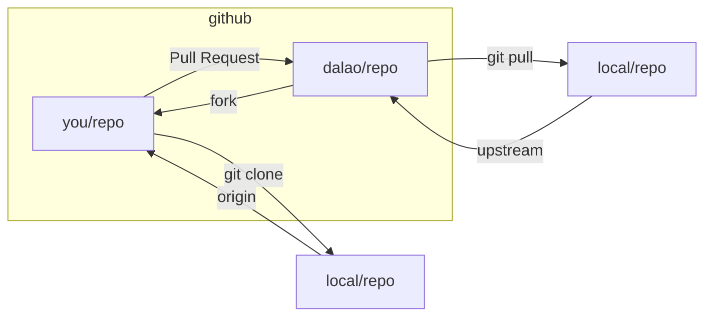

# Git Basic Tutorial

> 这个教程用于介绍如何使用 git 进行版本控制和团队协作。
>
> Author: LC
>
> Date: 2021-04-15


---


### 1. 下载 git 并配置好环境变量

这一步应该没什么好说的


### 2. 注册 gitee 账号

gitee 是中国的 git 代码托管平台，网速比较稳定。注意：**要把邮箱绑定了，之后有用**


### 3. 配置 git 信息

在命令行下输入如下命令

```
git config --global user.name "yourname"
git config --global user.email "youremail"
```

这里的 emai 就是第 2 步中绑定的邮箱。


### 4. Fork 本仓库

在 web 端到本仓库首页，可以看到 fork 按钮，此时就可以将本仓库 fork 到自己的账户上。fork 这个概念相当于把本仓库 copy 到自己的账号下。

对于第一次建立的仓库，应该首先用 git 工具初始化在目录下生成 .ignore 文件。

```bash
git init
```


### 5. clone 第 4 步 fork后的仓库到本地


### 6. 配置上游URL

输入命令

```bash
git remote add upstream [URL]
```

因为自己提交代码最后要提交到 「上游」，也就是被 fork 的那个仓库，所以需要进行如下配置。

这个 URL 可以在原仓库的地址栏处找到。

输入命令

```bash
git remote -v
```

可以查看 origin 和 upstream 是否配置成功。


### 7. 开始工作

**开始工作前首先要保证本地和 master 分支保持和最新同步**

输入命令

```bash
git pull --rebase upstream master
```

即可保持同步


**注意，不要在 master 分支进行修改**

因为我们本地的 master 分支要和上游 master 分支保持同步和通信，直接修改master 分支容易发生冲突，所以我们要创建一个新的分支。

输入命令

```bash
git checkout -b yourbranchname
```

创建新分支，分支名尽量有意义，虽然可以随便起。


### 8. 开始本地文件的修改

正式的工作内容，比如代码，写文档。


### 9. 提交 PR

输入命令

```bash
git status
```

可以查询更改状态。比如新建文件或文件夹以后刚开始会显示 untracked （不能追踪到）。删除文件或文本文档（也就是代码的变动都可以看出来）。

输入命令

```bash
git add .
```

将变动添加到暂存区（可以理解为缓存）。提交分为两个部分：1. 本地到暂存区；2. 暂存区到远程仓库分支。add 命令后的「 . 」可以理解为通配符，即将所有的变化统一提交到暂存区。

输入命令

```bash
git commit -s -m "yourcommentforthiscommitment"
```

`-s` 可以将 name 和 email 附在提交中，方便追踪管理，最后的字符串可以简要描述此次提交的目的，解决的问题。

输入命令

```bash
git push -u origin yourbranch 
```

将你的 commit 提交到 fork 仓库的非 master 分支（也就是之前你创建的分支）

提交工作完成！


### 10. Compare & pull request

如果前 9 步都没有问题的话，此时你的仓库会受到你提交的信息。此时进入 web 端进行操作。点击分支会收到刚刚提交的分支。然后进行比对，检查无误后就可以点击 **pull request** 进行提交了。我们一般提交到上游的 master 分支。


### 11. 删除分支

```bash
git checkout branchname
```

切换分支

```bash
git branch -a
```

列出所有分支

```bash
git checkout -d branchname
```

删除分支

```bash
git push origin --delete branchname
```

删除远程仓库的分支

### 12. 新增：关于 git 的流程




如图，一般情况下，默认自己为参与者，可以将 git 的流程看成三个仓库，`dalao/repo`, `you/repo`, `local/repo`。fork 不是原生 git 的概念，可以将 fork 当成是 GitHub 服务器上的 git clone。所以在本地项目中要参与其他人的项目（没有被认证为 contributor），不能直接向上游推 commit。而是要先推上自己的项目。然后向上游提交 Pull Request（这通常由）。由上游仓库的管理员决定是否接受你的 Pull Request。所以一般的项目要设置两个远程仓库，通过以下命令添加：

```bash
git remote add origin you/repo.git	# 设置 github 端的源为自己 fork 仓库的 URL
git remote add upstream dalao/repo.git # 设置 github 端的上游为创始者仓库的 URL
```

### 13. 新增：关于 git pull 和 git reset 的区别

 为什么 git pull 不能将自己在本地删除的文件恢复

因为 git pull 会保存自己在本地的修改，而另外一个命令 `git reset` 可以将仓库完全重置到远程仓库的某一次 commit 上，并且不会保留自己的修改。

例如，在本地，仓库中有两个 commits，A 和 B，在远程仓库中有两个 commit，A 和 C。这样的话执行如下命令

```bash
git pull
# A, B, C
git reset
# A, C
```

### 14. 新增：如何配置本地的 macOS GitHub环境

感觉虽然 gitee 也不错，但还是 GitHub 的体验更好一些。但是一些众所周知的原因 GitHub 的访问体验在大陆很不好，所以使用前要提前设置一下。

需要提前说明的是，要自己准备好科学上网手段，这里大家自由发挥，我是从一个看片老哥手里拿到的稳定ss。我们需要设置 git 工具走 shadowsocks 代理，要给 git 一个全局变量。

```bash
git config --global http.proxy "socks5://127.0.0.1:1086" # macOS 默认是 1086 端口
git config --global https.proxy "socks5://127.0.0.1:1086"
```

然后就可以正常使用了，不过这样有一个缺点，就是 git 工具必须得在 shadowsocks 开启的情况下才可以使用。一但 shadowsocks 节点/订阅挂掉就失去了与世界先进思想交流的机会。这时可以通过移除 proxy 重新访问 Gitee。

```bash
git config --global --unset http.proxy "socks5://127.0.0.1:1086"
git config --global --unset https.proxy "socks5://127.0.0.1:1086"
```

**补充**：2023 年 1 月 22 日至 23 日上午，我的 shadowsocks 节点供应商暂时停止了服务。他提供的服务说实话，很便宜，而且速度也还可以。唯一的缺点就是，不是很稳定，在最近一段时期里，经常是用了大概 3 至 5 天以后就不能使用了。所以临时期间我又找了一家代理。这个代理很稳定，速度和可访问性也很棒。他的唯一缺点是贵！一个月如果使用 300 GB 的流量套餐是 40 人民币。不过我也没有几个月可用了，今年下半年我就要去往美国了。这个代理支持 shadowrocket 和 clashX 订阅。clashX 订阅使用了不同的端口，所以配置 git proxy 也会有所不同。

应该使用：

```bash
git config --global http.proxy "http://127.0.0.1:7890"
git config --global https.proxy "http://127.0.0.1:7890"
git config --global all.proxy "socks5://127.0.0.1:7890"
```

删除这些代理配置的方法与上同。

### 15. 新增：如何配置 Xcode 上的 GitHub 环境

如果按照新增问题 14 的操作进行的话，IDEA 和命令行上可以正常进行拉取和推送操作。但是在 Xcode 上 git 工具还是无法正常从仓库拉取和推送。我从一篇文章上找到了关于这个问题的报告，[点击这里](https://openradar.appspot.com/radar?id=5008610828484608)以访问（可能需要科学上网）。这里简述一下这个问题的原因。Xcode 使用了一个 `helper service` （com.apple.dt.Xcode.sourcecontrol.Git）访问 GIT 服务器，这个服务使用了一个开源库 `libgit2.dylib (version 0.26.0)`。当连接远程仓库时，该进程调用了这个库的一个 API `git_remote_connect(...)`，这个库通过一个 `git_proxy_options` 的枚举去选择 git 的代理策略。定义如下：

```c
/**
 * The type of proxy to use.
 */
typedef enum {
	/**
	 * Do not attempt to connect through a proxy
	 *
	 * If built against libcurl, it itself may attempt to connect
	 * to a proxy if the environment variables specify it.
	 */
	GIT_PROXY_NONE,
	/**
	 * Try to auto-detect the proxy from the git configuration.
	 */
	GIT_PROXY_AUTO,
	/**
	 * Connect via the URL given in the options
	 */
	GIT_PROXY_SPECIFIED,
} git_proxy_t;
```

Xcode 调用时指定了 GIT_PROXY_NONE（不使用代理），这样就覆盖了 --global 级别的 git config，于是就无法通过代理访问 git 了。

解决方法：

1. 找到 `libgit2.dylib` 的源代码将其客制化，把调用的 GIT_PROXY_NONE 改为 GIT_PROXY_AUTO，不过我用 Spotlight 没有找到这个库的具体位置，也不太敢修改代码。这个方案只是理论可行，可以尝试但不建议；
2. 其实文章也给出了方法，就是在项目的路径下通过 Terminal 执行 `git config` 操作（注意，不必加入 `--global`）对项目设置代理，这样 Xcode 执行 git 操作时就可以识别到针对项目的代理配置，通过代理进行 git pull/push/clone 操作了。

这里的 open radar 是个好网站，关注 Apple Platform 相关问题的可以好好看看这个网站。

