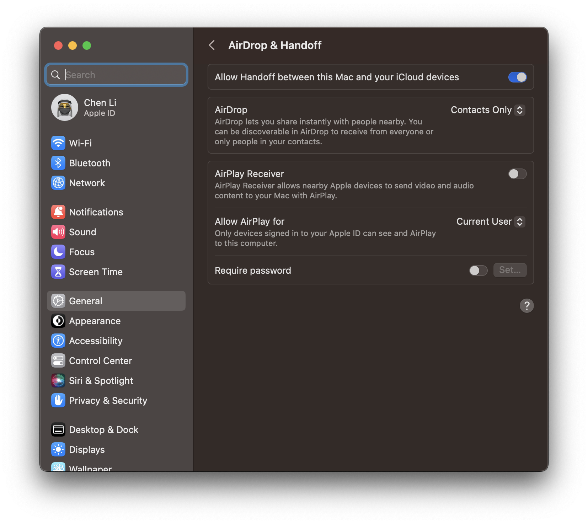

# macOS Bug Fix
## 0. Brief Introduction
Although there are many new features in macOS 12 and I love them very much such as live text and system translation, I have to say there are also too manu bugs that Apple really needs to fix them.

## 1. Safari
第一条该骂的就是，Safari 浏览器，那个浏览器实在是拉的离谱。更改到官方推荐的新特性以后会特别卡顿，被迫选回未升级的配置。希望能在下几个版本中修复这些 Bug。

## 2. Simplified Chinese IME
中文输入法，在开机大概一周之后就会莫名其妙的卡顿，我从官网上已经得知貌似这就是一个 Bug，按照客服的说法，关机后按着 command + option + p + r 开机，这样的话就会解决这个问题。我可以实验一下，如果没好的话，直接开骂好吧。我发现一条有用的解决方法，可以暂时性的解决问题。重启以后会暂时解决卡顿问题，那么重启简体中文输入法相关进程应该会解决问题，所以在终端中输入下面命令杀掉和简体中文输入法相关的进程。

```bash
pkill -f SCIM.app
```

## 3. Terminal
我又遇到了一个 macOS 的恶性 bug，这个 bug 是关于终端（Terminal）的。复现过程是：将一个项目做大量行的改动，然后提交 commit，commit 的 -m 的信息要写中文，这时就会触发第一次终端崩溃。然后，点击“重新打开”可以再次进入，但是输入一些字符后再次崩溃。再次打开时就会意外退出。之后重新启动也无效，而且重新启动会被卡住，毫无反应。最后必须借助长按电源键才能强行关闭，再次打开也无效。最后解决办法是，在反复重新打开时有可能会进入终端一段时间（依旧无响应），趁这段时间，长按图片将终端强行退出，此时会弹出和不做任何反应退出的退出界面不一样的提示界面，再该界面重新打开，即可再次打开终端。之后关闭所有程序，再次重启，即可解决问题。macOS 12 的 bug 真的好多，不想吐槽了。升到最后一个系统以后果断弃升，稳定为先！

## 4. TracePad Not Work
触摸板在工作一段时间后三指和四指手势会失效，但是其他手势可以正常工作。按照 Apple Support 论坛的“达摩院小智丈”说法，主要是 iTerm2 的问题，原回答如下：
> *经过这段时间的使用，发现可能与第三方软件 iTerm2 有关系。卸载后的一周时间 ，没有再出现同样的问题。还有就问题而言其实不是触摸板失效了，是调度中心与启动台失效了，在失效的时候，就算是鼠标去点击调度中心和启动台也是没有响应的。因为恰好对应触摸板的三指四指操作，所以我误以为是触摸板的问题。可能因为 iTerm2 导致 Dock 进程卡死了，其他第三方的软件也可能导致此类情况的发生。请各位知悉。*

按照 ta 的说法，这个问题可以通过强制结束 Dock 进程来重启 Dock 进程来解决，进入 Terminal 中执行以下命令来解决。

```bash
killall Dock
```

## 5. Airdrop Freezed
There are some situations that you can't click the cancel button or do any other thing when you share some files (whatever their size are big or not), especially image files. The only solution is that force quiting your finder and it'll be reopened by the system automatically.

## 6. Xcode Toolchain Missed
After a main version upgrade, such as Big Sur to Montery, you will face an annoying thing. Almost all your toolchain have been removed. I don't know why Apple removes all of basic toolchain softwares such as gcc, git, and ldb. Thankfully, there are two solutions for this annoying bug.

The first solution is very easy. You can execute `xcode-select --install` in terminal to reinstall the latest toolchain. In most cases, the installation process is very smooth.

The principle of second solution is the same as the first. You can reinstall the latest toolchain through dmg provided by Apple Official. When you find that you cannot reinstall in terminal, please use it.

## 7. AirDrop Screen Mirroring Doesn't Work
I found that I couldn't stream my iPhone to my Mac after I upgraded my macOS to version 13. It is a new feature since macOS 12 that you can stream your iPhone or iPad to your Mac. Altough many people don't think it's a very useful feature, I like it very much. You can stream your iPad to your Mac and use your Mac to record your iPad's screen. Thus you don't need to worry about size of recordings.

I googled how to solve it. However, Apple Support doesn't provide any solution. It just suggests users to check their devices if their AirDrop is open. The real solution is what I say below.

First, I wanna show what the bug is.


Second, go to System settings -> general -> AirDrop & Handoff, turn on AirDrop Receiver. AirDrop Receiver can receive screen mirroring requests from your iPhone or iPad.



Then you can see that your Mac appears in Screen Mirroring devices.


## 8. Widgets
It's an annoy bug on macOS 13. The widget select and edit page is very laggy. The page won't responce your clicks and even cause computer crash down! I have posted a question to talk about this big bug and notice macOS team to fix this disgusting thing asap.

There is a temporary solution: type this command into your termnial and execute it.

```bash
killall NotificationCenter
```

I don't know how this bug happened. It seems like opening widget edit page cause memory leak. Maybe macOS team doesn't think it is a problem. Although there are not many people using it daily. Many people just adding some widgets once after initialization, then never open it again.

***To be continued...***