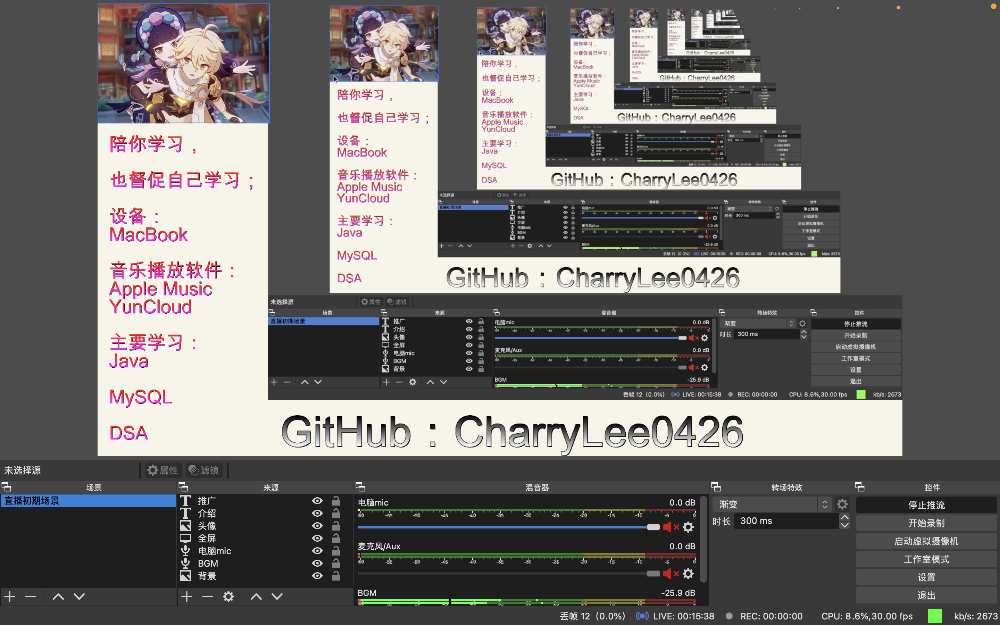
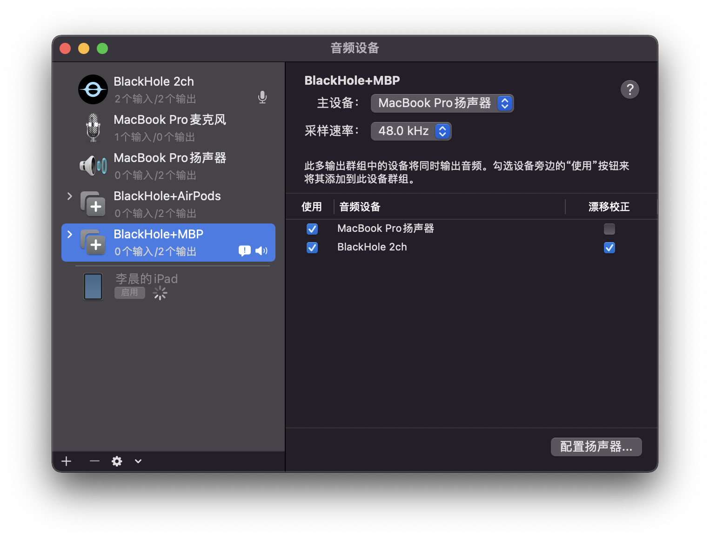

## macOS 上 B 站直播平台的搭建

### 1. 背景介绍

在 B 站上看到许多通过直播来督促自己学习的成功例子，自己也想试一下。这个寒假说实话也挺重要的，应该努力学习期末考试科目，而且也该为了实习、工作而努力了。前两天参加了一次字节跳动的面试，真的，自己的实力还是差的有些远，还需要努力才行。

### 2. 设备

我的设备是 MacBook Pro 2020 M1。系统版本是 macOS 12.1，之前没有任何的多余设置，理论上如果没有意外，按照我的教程你是肯定可以搭建一个可用的直播环境的。

### 3. 软件准备

在 Windows 和移动端上我们可以直接下载直播姬来进行推流和直播，十分简单，基本不需要配置。但是直播姬没有 macOS 版，所以只能使用其他推流软件将视频推到 B 站直播的服务器。这里我使用的是 OBS Studio。这是一个在 Windows, Linux, macOS 上都可用的开源直播软件，之前我常用它录制电脑视频，它也可以作为直播推流软件。

对于处理器为 Apple Silicon 的电脑，在下载软件之前可以在以下网站查询你要下载的软件对于 ARM 的支持情况。

[https://doesitarm.com](https://doesitarm.com)

它的下载地址是在：[https://obsproject.com](https://obsproject.com)

我们实现一场直播，最少需要一个推流软件，一个音频采集软件，一个麦克风。如果需要的话，还可以配一个摄像头。而麦克风只能采集环境中的音频，如果电脑中的 BGM 也用麦克风采集的话容易和人声打架，所以需要再下一个虚拟音频输入输出软件，这个经典的软件有 Soundflower, Loopback。但现在这两个软件都不太行，因为前者没有对 M1 芯片的支持，而第二个软件是买断制软件，如果想没有限制的使用需要花费99块美元（631.42人民币）。否则直播10分钟以后就会自动加噪音，直播体验会相当差。所以，我们需要使用一个新的虚拟 MIDI 软件，BlackHole。这个软件是开源的，同时也对 M1 芯片有原生支持。它的 GitHub 地址是：[https://github.com/ExistentialAudio/BlackHole](https://github.com/ExistentialAudio/BlackHole)。这个项目有 7.4 k 的 star，还是挺牛的项目。这个软件的官网介绍的相当详细，甚至为其开发了 installer 和 uninstaller。下载后安装即可，不知道自己的需求的话下载那个 2ch 结尾的软件，准没错。

### 4. 正式配置

一个直播最基础的，就是推流、录制屏幕、录制声音，直播画面布局，下面我将从这几个方面介绍配置方法。

#### 4.1 推流

在完成 B 站直播实名认证以后，进入到开播中心，设置好房间的信息后点击开播，就可以看到 rtmp 地址和密钥，这就是我们推流的目标服务器。记住这些。

然后打开 OBS，OBS 的操作界面大概长这样。

然后按下 `⌘ + ,` 打开设置界面，然后选择“推流”，服务那一项里有很多预先的设定，大部分都是国外的直播平台，在服务里选择“自定义”。然后将 rtmp 地址贴入到 URL 中，然后将密钥贴到对应的密钥框中。黏贴好后点击左下角的应用执行更改，然后点击好退出偏好设置。

然后点击主页面右下角的开始推流，如果可以正常工作，那么就说明推流成功，此时你应该可以在直播间里看到一个黑色的画面。

注意，每次下播后再次直播，会重置密钥，再次直播前必须先在偏好设置改了密钥后才能再次直播。现在 B 站只允许在中国大陆的流量进行直播，所以，，，dddd。做技术直播用魔法不可避免，有时候查资料什么的确实需要，不要开启全局，这样就可以保证推流流量不走魔法。否则，不能开播。

#### 4.2 录制屏幕

录制屏幕时，必须首先在偏好设置处将录制屏幕的权限赋予 OBS，然后重启 OBS 应用更改。

然后在来源处点击加号，添加一个来源。关于屏幕，或者说视频的源的种类一共有 3 类：显示器采集、窗口采集和视频采集设备。第一个采集的是整个屏幕的信号，第二个采集的是某个窗口的信号，第三个采集的是摄像头的信号。按照我的经验，窗口采集的体验不如显示器采集的信号。因为 macOS 每个窗口的尺寸并不固定，而且某个应用如果在全屏下运行时，那个应用此时视作一个“桌面”而不是一个“窗口”。容易让自己直播画面的尺寸忽然改变，体验不好。所以，尽量用显示器采集。视频采集设备是当你想“露脸”时用的。这一步还比较简单。在来源处可以对来源重命名，还可以改变来源的尺寸，位置。

#### 4.3 录制音频

其实最难的部分就是录制音频，因为 macOS 的原因，导致采集应用内的音频比较困难。我们之前已经下载了虚拟 MIDI 软件 BlackHole，只要添加一个音频输入采集，将来源设置成 BlackHole 就可以捕捉到电脑自己产生的声音了，比如音乐软件的音乐，作为直播间的 BGM。

但这样对直播有一个问题，我们并不能听到声音，也就是说观众可以听到但 up 听不到，自己掌握不了进度。这时候我们需要创建一个 MIDI 设备。创建 MIDI 设备，需要打开“音频 MIDI 设置”这个应用，点击加号，添加多输出设备。如果你有耳机或者 AirPods 的话，建议创建两个多输出设备，如图所示。

要保证实际的输出设备在第一位，BlackHole 在第二位，并且虚拟输出设备要开启漂移校正保证音质。当直播不想说话时让扬声器和虚拟输出设备同时发声，当想说话互动时，选择 BlackHole+AirPods，此时 AirPods 作为 BGM 的耳返。

使用多输出设备时，先调整实际输出设备的音量，当输出设备切换后，实际输出设备的音量会被继承。

录制人声时，最好使用电脑的麦克风，实测录制的音质不错。至于 BGM 和人声的音量分配，这个可以实际测试后找到最合适的值。

#### 4.4 直播画面布局

技术直播一般不会只有一个屏幕，除非是上课。我们需要对直播画面进行布局。我们可以在网上找到很多成熟的直播背景图，或者自己设计一个背景图。

我是自己设计了一个背景的分配，其实很简单，就是用 GoodNote 画了一个背景的分配，然后导成照片，传到电脑上加一个背景就可以了。

OBS 的源里可以加文本、媒体源（可以设计个动态形象）等等，可以做成一个不错的背景。