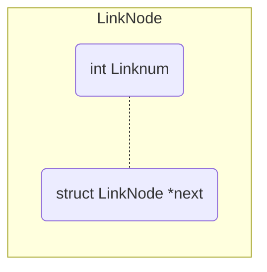

## <center>程序设计第二周实验报告</center>

|   姓名   |    李晨     |
| :------: | :---------: |
|   学号   | 19030100104 |
| 选做题号 |  2_1 , 2_2  |

### 一.模拟堆栈

#### (a).算法描述

​		本题要求实现堆栈的模拟 , 包括实现入栈 , 出栈以及返回栈顶元素等操作. 为了容易体现出栈满以后的报错和栈清空以后继续执行出栈的报错 , 我们规定栈 $val$ 的深度$deep=5$. 同时定义一个int变量$sp$来当作"游标" , 用来表明当前栈顶元素上第一个空闲元素在栈中的位置. 注意 : $sp$ 的取值可能为$5$或$0$ , 即超出顶部或穿过底部 , 而这也是判断是否溢出或清空完毕的标志. 我们定义以下函数.

|       函数        |       用途       |
| :---------------: | :--------------: |
| void push(int n)  | 将整数n压入栈中  |
| void gettop(void) | 输出栈顶元素的值 |
|  void pop(void)   |       出栈       |
| void getall(void) | 返回栈中所有元素 |

​		入栈函数执行$val[sp++] = n;$游标在入栈完成后自动向上移动一位. 出栈函数当$sp>0$时将$sp-=1$.

#### (b).源代码

no2_1.c

```c
#include<stdio.h>
#include<string.h>
#define VALDEEP 5
/*
指定栈的深度为5,用val存储栈值
用sp指明当前所处栈的位置.
*/
int val[VALDEEP];
int sp = 0;

/*
定义函数:
push入栈,
gettop返回栈顶元素
pop出栈
getall返回栈中所有元素
*/
void push(int n);
void gettop(void);
void pop(void);
void getall(void);

//主程序
int main() {
	int num;
	int ch;
	//num作为向栈中传值的变量,ch作为识别操作符.

	printf("堆栈模拟,栈深度为5.\n+:入栈\n-:出栈\n*:返回当前栈顶元素\n");
	while((ch=getchar())!=EOF)
		if (ch != '\n') {	//getchar()一次只读一个字符,跳过回车.
			switch (ch) {
			case '+': {
				printf("压入栈中的元素值\n");
				scanf("%d", &num);
				push(num);
				getall();
				break;
			}
			case '-': {
				pop();
				getall();
				break;
			}
			case '*': {
				gettop();
				break;
			}
			default: {
				printf("操作指令错误\n+:入栈	-:出栈	*:返回栈顶\n");
				break;
			}
			}
		}
	return 0;
}

void push(int n) {
	if (sp < VALDEEP) {
		val[sp++] = n;
	}
	else {
		printf("error:栈已满,不能再压入值!\n");		//当sp大于深度时即表示溢出
	}
}

void gettop(void) {
	printf("现在的栈顶元素是:  %d\n", val[sp - 1]);
}

void pop(void) {
	if (sp > 0) {
		sp -= 1;
		printf("一个栈顶元素已弹出!\n");
	}
	else {
		printf("error:栈为空,找不到其他元素.\n");	//当sp为0时栈已清空.
	}
}

void getall(void) {
	int tempcount = sp-1;
	if (tempcount == -1) {
		printf("栈中无元素!\n");
	}
	else {
		printf("现在栈内元素有:\n\n");
		for (; tempcount >= 0; tempcount--)
			printf("%d\n", val[tempcount]);
		printf("\n");
	}
}
```


### 二.动态链表

#### (a).算法描述

​		本题要求我们要实现一个动态链表的创建 , 插入 , 删除 , 展示链表元素的功能. 由于未对链表做更多要求 , 所以默认输入完全合法 , 链表元素的代表元素为一整型数. 且认为删除为删除第n个元素 , 插入为向第n个元素的前驱方向插入元素. 下面列出函数列表

|                          函数                          |              功能               |
| :----------------------------------------------------: | :-----------------------------: |
|               struct LinkNode* create();               |            创建链表             |
|  struct LinkNode* del(struct LinkNode* head, int n);   |      删除head链表第n项元素      |
| struct LinkNode* insert(struct LinkNode* head, int n); | 向head链表第n项元素前驱插入元素 |
|         void showLink(struct LinkNode* head);          |          输出链表元素           |

​	链表单个元素组成为



​		链表组成形式为


​		在create函数中 , 用结构体指针p1代表当前元素 , p2代表前一个元素 , n来计数.n=1时将当前元素p1赋给head作为第一个元素. 当p1中输入的num不为0且n>1后 , 上一个元素p2指向p1 , 同时将p1赋给p2 , 再用p1开辟新的内存空间. 当创建完毕后 , p2代表最后一个元素 , p2->next赋为NULL , 返回head.

​		插入insert函数中 , 结构体指针p1,p2,p3 , 代表当前元素(找到插入位置) , 上一个元素 , 插入元素. 若n为1 , 则用p3开辟新内存 , 同时p3指向head , 函数返回head. 否则 , 找到插入位置后 , 用p3开辟新内存空间 , 同时将其和插入位置和插入前元素连接起来 , 返回head.

​		删除del函数中 , 结构体指针p1,p2 , 代表当前元素(找到删除位置) , 上一个元素. 若n为1 , 则将head指针后移一位 , 并且释放head内存. 否则 , 找到删除位置后 , 将删除位置前后元素通过指针连接起来 , 同时释放p1内存 , 返回head.

​		展示showLink函数 , 从head开始 , 到最后一个元素依次输出即可.

#### (b)源代码

```c
#include<stdio.h>
#include<malloc.h>

/*
定义单个元素
*/
struct LinkNode {
	int linknum;
	struct LinkNode* next;
};
/*
声明各个函数.
*/
struct LinkNode* create();
struct LinkNode* del(struct LinkNode* head, int n);
struct LinkNode* insert(struct LinkNode* head, int n);
void showLink(struct LinkNode* head);

int main() {
	struct LinkNode* p;
	int choice;
	//操作标记变量
	int location;
	//位置标记变量
	printf("现在开始创建整数链表,输入0后回车表示输入结束\n");
	p = create();
	//创建链表
	printf("链表创建完毕,可插入或卸载或输出所有元素.\n+:向第n个元素的前驱插入\n");
	printf("-:删除第n个元素\n*:列出链表元素\n");
	while ((choice = getchar())!='EOF') {
		if ('+' == choice) {
			printf("插入位置为\n");
			scanf("%d", &location);
			p = insert(p, location);
		}
		if ('-' == choice) {
			printf("删除位置为\n");
			scanf("%d", &location);
			p = del(p, location);
		}
		if ('*' == choice) {
			showLink(p);
			//展示链表所有元素
		}
	}
	return 0;
}

//创建链表
struct LinkNode* create() {
	struct LinkNode* head;
	struct LinkNode* p1, * p2;
	//p1为下一个结点,p2为当前结点.
	int n = 0;
	//n为
	p1 = p2 = (struct LinkNode*)malloc(sizeof(struct LinkNode));
	//为p1,p2申请内存.
	printf("输入元素:\n");
	scanf("%d", &(p1->linknum));
	head = NULL;
	while (0 != p1->linknum) {
		n++;
		if (n == 1) {
			head = p1;
			//使head指向链表首元素
		}
		else {
			p2->next = p1;
			//上一个元素指向当前元素
		}
		p2 = p1;
		//将本元素复制到p2中作为上一个元素
		p1 = (struct LinkNode*)malloc(sizeof(struct LinkNode));
		//为下一个元素申请新的内存
		printf("输入元素:\n");
		scanf("%d", &(p1->linknum));
	}
	p2->next = NULL;
	//最后一个元素指向NULL表示结束
	return(head);
}

//删除第n个元素
struct LinkNode* del(struct LinkNode* head, int n) {
	struct LinkNode* p1, * p2;
	//表示本元素(将被删除的)和上一个元素
	p1 = head;
	//保存head首地址
	if (n == 1) {
		p1 = p1->next;
		printf("删除完成\n");
		free(head);
		//删除第一个元素则首指针向后一位.释放head内存.
		return p1;
	}
	else {
		for (int tempcount = 0; tempcount < n - 1; tempcount++) {
			p2 = p1;
			p1 = p1->next;
		}
		//移动到待删除位置
		p2->next = p1->next;
		//连接前后元素
		free(p1);
		//释放内存
	}
	printf("删除完成\n");
	return head;
}

struct LinkNode* insert(struct LinkNode* head, int n) {
	struct LinkNode* p1, * p2, * p3;
	//p1,p2代表插入位置原来元素和其前驱,p3为插入元素指针
	p1 = head;
	if (n == 1) {
		p3 = (struct LinkNode*)malloc(sizeof(struct LinkNode));
		//申请内存
		printf("插入元素:\n");
		scanf("%d", &(p3->linknum));
		p3->next = p1;
		//插入到head前
		printf("插入完成!");
		return p3;
	}
	else {
		for (int tempcount = 0; tempcount < n - 1; tempcount++) {
			p2 = p1;
			p1 = p1->next;
		}
		//找到插入位置.
		p3 = (struct LinkNode*)malloc(sizeof(struct LinkNode));
		printf("插入元素:\n");
		scanf("%d", &(p3->linknum));
		p2->next = p3;
		p3->next = p1;
	}
	printf("插入完成!\n");
	return head;
}
void showLink(struct LinkNode* head) {
	printf("现在链表元素为\n");
	while (head->next != NULL) {
		printf("%d  ", head->linknum);
		head = head->next;
	}
	printf("%d\n", head->linknum);
}
```


### 三.收获

​		通过本次实验掌握了基础的数据结构 , 锻炼了解决问题的能力. 也进一步巩固了指针和结构体的相关内容.